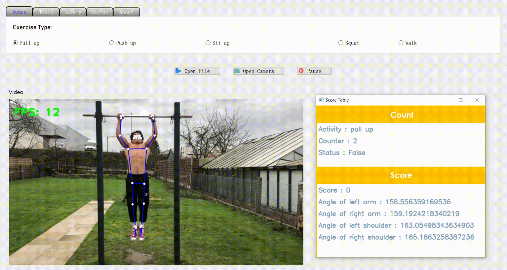
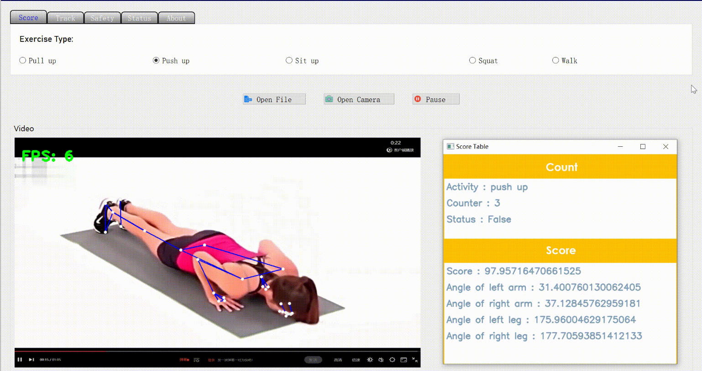
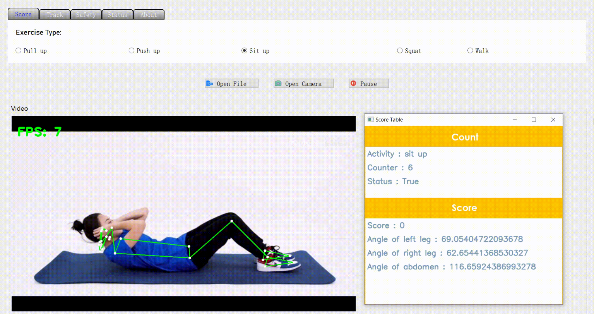
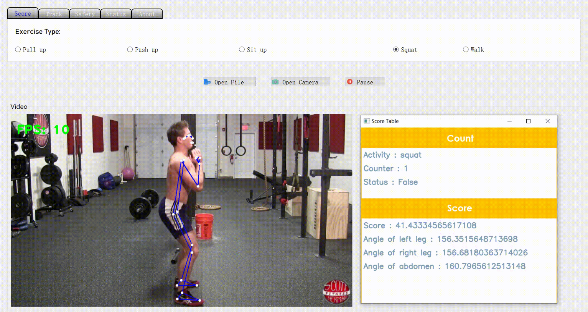
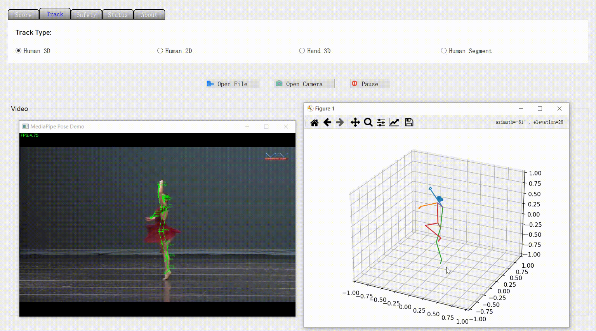
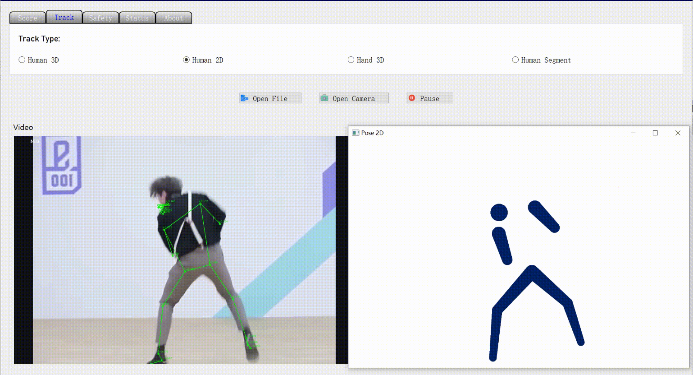
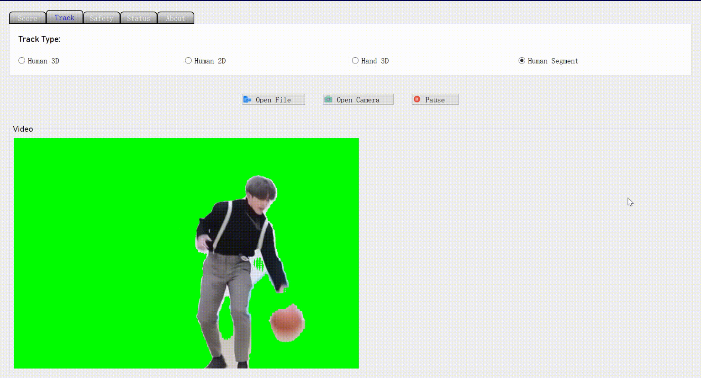
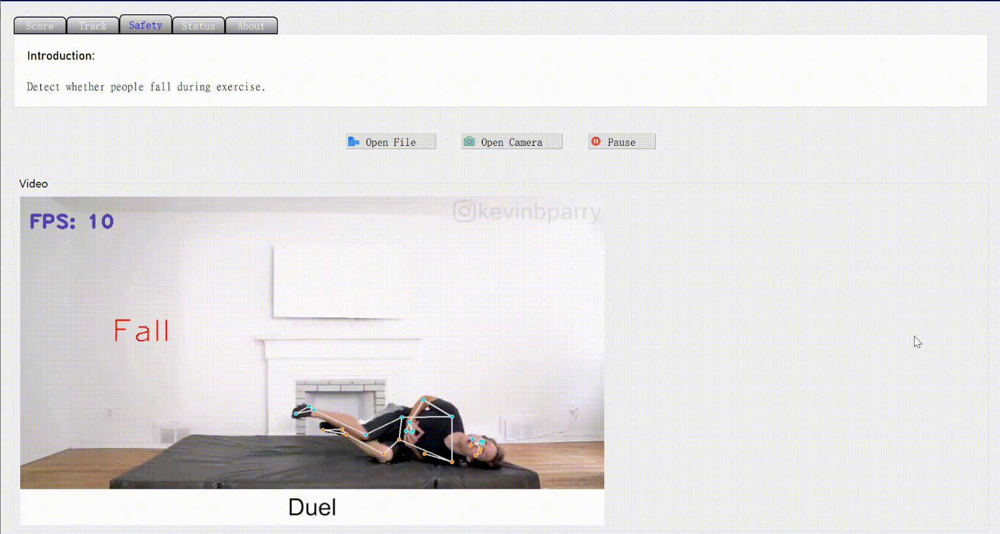

# Exercise System Based on Pose Estimation

## Results

### 1. Score and Count

- Pull up

  

- Push up

  

- Sit up

  

- Squat

  

## 2. Pose Tracking

- 3D

  

- 2D

  

- Segment

  

## 3. Safety

- Fall down

  

- Be tired


# Usage

```
pip install -r requirements.txt
python main.py
```


# Acknowledge


